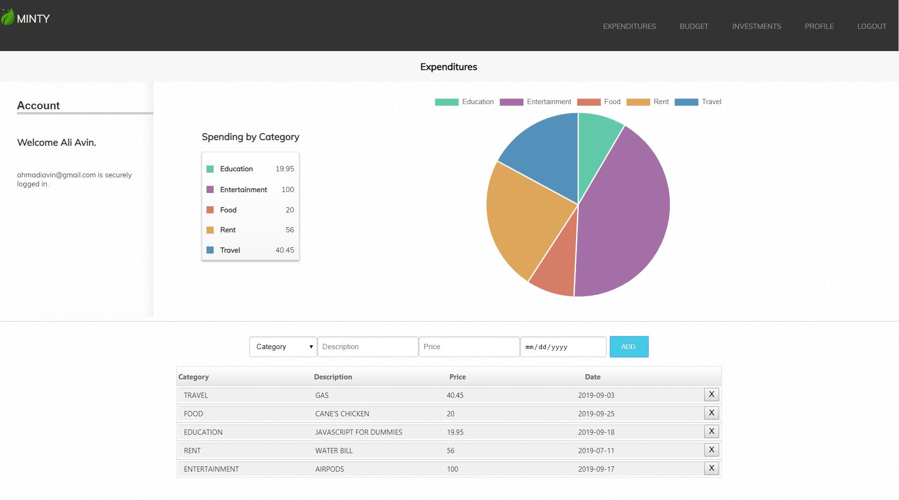
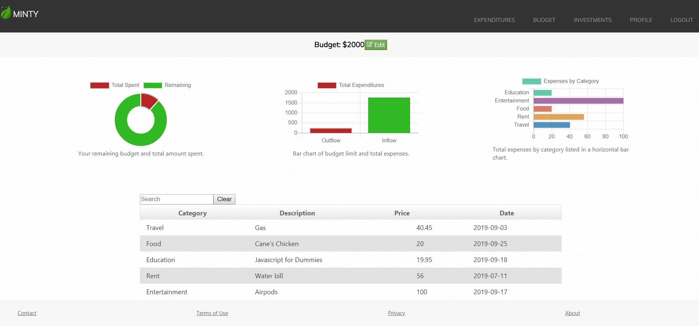
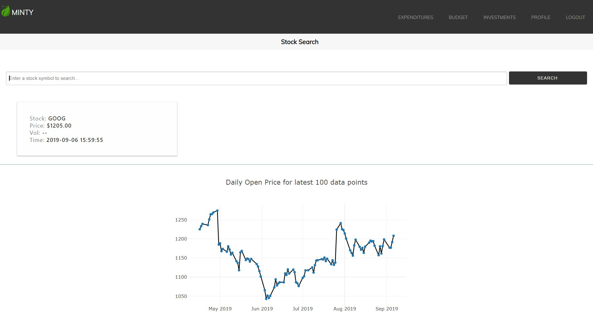

## Minty

### A personal budgeting dashboard inspired by Mint

- Built primarily with the SERN Stack. Full list of Technologies used : React, Redux, Sass, Node, Express, bcrypt, PostgreSQL,
  Chart.js.

- Won BEST UX/UI design at DevMountain
- Individual project completed in two weeks

- Self taught Sass and Chart.js to display data in a stylish and meaningful way.

- - - -

Expenditures view. You can add and delete items to be tracked. 
- - - -

Budget view. You can edit your budget, filter and search expenses, view budget vs expenses. 
- - - -

Stock view. You can enter a stock symbol to see information on price/volume and a chart. 